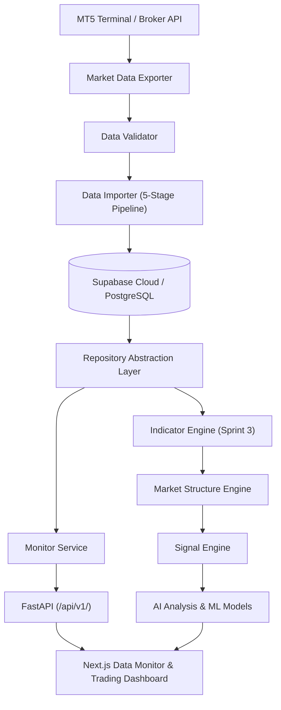

# Trading Intelligence Core — Architecture Specification

## 1. Overall Platform Architecture

Trading Intelligence Core is designed as an enterprise-grade quantitative trading platform and data intelligence foundation. The platform follows **Clean Architecture**, **SOLID Principles**, and strict decoupling between data ingestion, storage, quantitative analysis, machine learning inference, and UI visualization.



---

## 2. Backend Architecture

The backend is structured under `backend/app/` adhering to layered architecture:

- **Presentation Layer (`app/api/v1/`)**: Versioned FastAPI routers receiving HTTP requests and returning standardized JSON response envelopes.
- **Service Layer (`app/services/`)**: Orchestrates business logic, calculates domain metrics, and triggers alerts.
- **Domain Layer (`app/core/`, `app/indicator_engine/`, `app/ai_engine/`)**: Pure business models, quantitative indicator algorithms, and ML models.
- **Repository Layer (`app/repositories/`)**: Abstract data access interfaces handling database ORM (SQLAlchemy / Supabase) and fallback data providers.
- **Data Foundation (`backend/market_data/`)**: Isolated exporter, validator, and importer pipelines for OHLCV data ingestion.

---

## 3. Frontend Architecture

The frontend is built using **Next.js (App Router)**, **TypeScript**, **Tailwind CSS**, and **Lucide React Icons**:

- **Page Views (`frontend/src/app/`)**: High-level page wrappers and tab orchestrators.
- **Components (`frontend/src/components/`)**: Modular, reusable UI widgets (System Health, Data Explorer, Quality Meter, Summary Bar, Market Snapshot).
- **Service Layer (`frontend/src/services/`)**: Typed API client encapsulating Axios requests to `/api/v1/`.

---

## 4. End-to-End Data Flow

```
MT5 ──► Exporter ──► Validator ──► Importer ──► Supabase ──► Repository ──► Indicator Engine ──► Market Structure ──► Signal Engine ──► AI Analysis ──► Dashboard
```

1. **Ingestion**: `mt5_client` fetches OHLCV candles from MT5 (or Yahoo Finance fallback).
2. **Export**: `exporter.py` outputs standardized CSV files alongside `metadata.json` and `manifest.json`.
3. **Validation**: `validator.py` applies OHLC integrity rules, deduping, and gap detection.
4. **Import**: `importer.py` normalizes and bulk inserts valid prices into Supabase `market_prices`.
5. **Consumption**: Indicator Engine, Market Structure, AI Models, and Dashboards consume validated price data via the `Repository Layer`.

---

## 5. Module Dependencies

```
[market_data/exporter] ──► [validator] ──► [importer]
                                                │
                                                ▼
[Database / Supabase] ◄─────────────────────────┘
        │
        ▼
[Repository Layer]
        │
        ├──► [Monitor Service] ──► [FastAPI /api/v1/]
        ├──► [Indicator Engine]
        │         │
        │         ▼
        │    [Market Structure Engine]
        │         │
        │         ▼
        │    [Signal Engine]
        │         │
        │         ▼
        └────► [AI Engine]
```

---

## 6. Future Expansion Strategy

- **Sprint 3 (Indicator Engine)**: Implement standard indicators (EMA, RSI, VWAP, ATR, MACD, Bollinger) matching `INDICATOR_INTERFACE.md`.
- **Sprint 4 (Market Structure)**: Swing High/Low detection, Order Blocks, Liquidity Pools, Fair Value Gaps (FVG).
- **Sprint 5 (Signal & Strategy Lab)**: Rule-based strategy backtesting engine and signal triggers.
- **Sprint 6 (AI Engine Integration)**: Real-time ML feature extraction and directional probability scoring.
